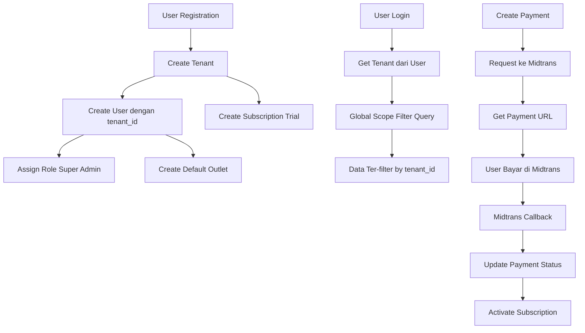

# Plan: Implementasi Sistem Subscription & Multi-Tenancy

## Overview

Implementasi sistem subscription dengan multi-tenancy untuk memisahkan data setiap organisasi/perusahaan. Setiap tenant memiliki subscription sendiri, dan semua data bisnis (products, customers, transactions, dll) terisolasi per tenant menggunakan Global Scope.

## Architecture Flow

## Implementation Steps

### Phase 1: Database Schema

#### 1.1 Create Tenants Table

- **File**: `database/migrations/YYYY_MM_DD_HHMMSS_create_tenants_table.php`
- Kolom: id, name, email, phone, address, owner_name, is_active, timestamps
- Index: email (unique)

#### 1.2 Create Subscriptions Table

- **File**: `database/migrations/YYYY_MM_DD_HHMMSS_create_subscriptions_table.php`
- Kolom: id, tenant_id (FK), plan_name, status, price, period, start_date, end_date, next_billing_date, features (JSON), max_outlets, timestamps
- Index: tenant_id, status

#### 1.3 Create Subscription Payments Table

- **File**: `database/migrations/YYYY_MM_DD_HHMMSS_create_subscription_payments_table.php`
- Kolom: id, subscription_id (FK), order_id (unique), payment_method, amount, status, transaction_reference, midtrans_response (JSON), payment_date, notes, timestamps
- Index: order_id, status

#### 1.4 Add tenant_id to Existing Tables

Migrations untuk tambah kolom `tenant_id` ke:

- `users` - setelah id
- `outlets` - setelah id
- `products` - setelah id
- `categories` - setelah id
- `units` - setelah id
- `customers` - setelah id
- `suppliers` - setelah id
- `transactions` - setelah id
- `transaction_items` - setelah id
- `purchases` - setelah id
- `purchase_items` - setelah id
- `product_stocks` - setelah id
- `stock_movements` - setelah id
- `stock_transfers` - setelah id
- `stock_transfer_items` - setelah id
- `expenses` - setelah id

Setiap migration:

- Tambah kolom `tenant_id` dengan FK constraint
- Tambah index untuk performance
- Update unique constraints (SKU, barcode menjadi unique per tenant)

### Phase 2: Models & Traits

#### 2.1 Create Tenant Model

- **File**: `app/Models/Tenant.php`
- Relationships: hasMany(User), hasMany(Outlet), hasOne(Subscription)
- Methods: hasActiveSubscription(), getSubscriptionPlan()

#### 2.2 Create Subscription Model

- **File**: `app/Models/Subscription.php`
- Relationships: belongsTo(Tenant), hasMany(SubscriptionPayment)
- Methods: isActive(), isExpired(), hasFeature(string)

#### 2.3 Create SubscriptionPayment Model

- **File**: `app/Models/SubscriptionPayment.php`
- Relationships: belongsTo(Subscription)

#### 2.4 Create TenantScoped Trait

- **File**: `app/Traits/TenantScoped.php`
- Auto-filter query berdasarkan tenant_id dari Auth::user()
- Auto-set tenant_id saat creating model
- Method: withoutTenantScope() untuk bypass (System Admin)

#### 2.5 Update Existing Models

Update semua models dengan trait TenantScoped:

- Product
- Category
- Unit
- Customer
- Supplier
- Transaction
- TransactionItem
- Purchase
- PurchaseItem
- ProductStock
- StockMovement
- StockTransfer
- StockTransferItem
- Expense
- User (untuk filter user per tenant)

Tambahkan:

- `tenant_id` ke fillable
- Relationship `tenant(): BelongsTo(Tenant)`

#### 2.6 Update User Model

- Tambah `tenant_id` ke fillable
- Tambah relationship `tenant(): BelongsTo(Tenant)`
- Update outlet relationship tetap ada

#### 2.7 Update Outlet Model

- Tambah `tenant_id` ke fillable
- Tambah relationship `tenant(): BelongsTo(Tenant)`
- Methods: hasActiveSubscription() (via tenant)

### Phase 3: Configuration & Services

#### 3.1 Install Midtrans Package

- **Command**: `composer require midtrans/midtrans-php`
- Update `composer.json`

#### 3.2 Create Midtrans Config

- **File**: `config/midtrans.php`
- Config: server_key, client_key, is_production, callback_url

#### 3.3 Update .env

- Tambah: MIDTRANS_SERVER_KEY, MIDTRANS_CLIENT_KEY, MIDTRANS_IS_PRODUCTION, MIDTRANS_CALLBACK_URL

#### 3.4 Create MidtransService

- **File**: `app/Services/MidtransService.php`
- Methods:
  - createPayment(array $orderData): string (return payment URL)
  - verifySignature(array $data, string $signature): bool
  - getPaymentStatus(string $orderId): array

#### 3.5 Create SubscriptionService

- **File**: `app/Services/SubscriptionService.php`
- Methods:
  - getPlanData(string $planName, string $period): array
  - checkFeature(Outlet $outlet, string $feature): void
  - hasFeature(Outlet $outlet, string $feature): bool

### Phase 4: Middleware

#### 4.1 Create EnsureTenant Middleware

- **File**: `app/Http/Middleware/EnsureTenant.php`
- Cek user punya tenant_id
- Cek subscription aktif
- Return 403 jika tidak valid

#### 4.2 Create CheckSubscription Middleware

- **File**: `app/Http/Middleware/CheckSubscription.php`
- Cek subscription aktif
- Return 403 jika expired

#### 4.3 Create AdminOnly Middleware

- **File**: `app/Http/Middleware/AdminOnly.php`
- Cek user punya role "System Admin"
- Hanya untuk admin panel API

### Phase 5: Controllers

#### 5.1 Update AuthController

- **Method**: `register()` - Update untuk create tenant flow
  - Create Tenant
  - Create User dengan tenant_id
  - Assign Role "Super Admin"
  - Create Default Outlet
  - Create Subscription (Trial 14 hari)
- **Method**: `login()` - Include tenant_id dalam response

#### 5.2 Create SubscriptionController

- **File**: `app/Http/Controllers/Api/SubscriptionController.php`
- Methods:
  - index(): Get subscription tenant user
  - store(): Create subscription & payment request
  - createPayment(): Request payment ke Midtrans
  - paymentStatus(): Check payment status
  - renew(): Perpanjang subscription
  - midtransCallback(): Handle callback dari Midtrans (public route)

#### 5.3 Create AdminSubscriptionController

- **File**: `app/Http/Controllers/Api/AdminSubscriptionController.php`
- Methods:
  - index(): List semua subscription
  - show(): Detail subscription
  - update(): Update subscription
  - activate(): Aktifkan manual
  - deactivate(): Nonaktifkan

#### 5.4 Create AdminTenantController

- **File**: `app/Http/Controllers/Api/AdminTenantController.php`
- Methods:
  - index(): List semua tenant
  - show(): Detail tenant
  - update(): Update tenant
  - destroy(): Delete tenant

#### 5.5 Create AdminPaymentController

- **File**: `app/Http/Controllers/Api/AdminPaymentController.php`
- Methods:
  - index(): List semua payment
  - show(): Detail payment
  - update(): Update payment status (manual confirmation)

#### 5.6 Create AdminDashboardController

- **File**: `app/Http/Controllers/Api/AdminDashboardController.php`
- Methods:
  - index(): Dashboard stats (total tenants, active subscriptions, revenue, dll)

### Phase 6: Routes

#### 6.1 Update routes/api.php

- Tambah route group untuk subscription:
  - GET /api/v1/subscriptions
  - POST /api/v1/subscriptions/create-payment
  - GET /api/v1/subscriptions/payment-status/{id}
  - POST /api/v1/subscriptions/renew
  - POST /api/subscriptions/midtrans-callback (public, no auth)
- Update route register untuk support tenant creation

#### 6.2 Create routes/admin-api.php

- **File**: `routes/admin-api.php`
- Register di RouteServiceProvider
- Routes dengan middleware AdminOnly:
  - GET /admin-api/v1/tenants
  - GET /admin-api/v1/tenants/{id}
  - PUT /admin-api/v1/tenants/{id}
  - DELETE /admin-api/v1/tenants/{id}
  - GET /admin-api/v1/subscriptions
  - GET /admin-api/v1/subscriptions/{id}
  - PUT /admin-api/v1/subscriptions/{id}
  - POST /admin-api/v1/subscriptions/{id}/activate
  - POST /admin-api/v1/subscriptions/{id}/deactivate
  - GET /admin-api/v1/payments
  - GET /admin-api/v1/payments/{id}
  - PUT /admin-api/v1/payments/{id}
  - GET /admin-api/v1/users (cross-tenant)
  - GET /admin-api/v1/dashboard

### Phase 7: Update Existing Controllers

Update semua controllers untuk support tenant_id:

- ProductController - Pastikan Global Scope bekerja
- CustomerController - Pastikan Global Scope bekerja
- TransactionController - Pastikan Global Scope bekerja
- OutletController - Filter outlets by tenant_id
- UserController - Filter users by tenant_id (kecuali System Admin)
- Semua controllers lainnya

### Phase 8: Request Validation

#### 8.1 Create RegisterWithTenantRequest

- **File**: `app/Http/Requests/RegisterWithTenantRequest.php`
- Validation rules untuk registration dengan tenant
- Fields: name, email, password, company_name, phone, address

#### 8.2 Create CreateSubscriptionRequest

- **File**: `app/Http/Requests/CreateSubscriptionRequest.php`
- Validation: plan_name, period

### Phase 9: Seeders

#### 9.1 Create TenantSeeder (Optional)

- Untuk testing dengan sample tenants

#### 9.2 Update RolePermissionSeeder

- Tambah role "System Admin" dengan permissions:
  - admin.tenants.*
  - admin.subscriptions.*
  - admin.payments.*
  - admin.users.view (cross-tenant)

### Phase 10: Testing & Documentation

#### 10.1 Update API Documentation

- **File**: `docs/API.md`
- Tambah dokumentasi endpoint subscription & admin panel

#### 10.2 Testing Checklist

- Registration flow dengan tenant creation
- Login dan isolasi data
- Create subscription & payment
- Midtrans callback handling
- Admin panel API access
- Global Scope working correctly

## Files to Create/Modify

### New Files (18 files)

1. `database/migrations/..._create_tenants_table.php`
2. `database/migrations/..._create_subscriptions_table.php`
3. `database/migrations/..._create_subscription_payments_table.php`
4. `database/migrations/..._add_tenant_id_to_users_table.php`
5. `database/migrations/..._add_tenant_id_to_outlets_table.php`
6. `database/migrations/..._add_tenant_id_to_products_table.php`
7. `database/migrations/..._add_tenant_id_to_[other_tables]_table.php` (13 migrations)
8. `app/Models/Tenant.php`
9. `app/Models/Subscription.php`
10. `app/Models/SubscriptionPayment.php`
11. `app/Traits/TenantScoped.php`
12. `app/Services/MidtransService.php`
13. `app/Services/SubscriptionService.php`
14. `app/Http/Middleware/EnsureTenant.php`
15. `app/Http/Middleware/CheckSubscription.php`
16. `app/Http/Middleware/AdminOnly.php`
17. `app/Http/Controllers/Api/SubscriptionController.php`
18. `app/Http/Controllers/Api/AdminSubscriptionController.php`
19. `app/Http/Controllers/Api/AdminTenantController.php`
20. `app/Http/Controllers/Api/AdminPaymentController.php`
21. `app/Http/Controllers/Api/AdminDashboardController.php`
22. `app/Http/Requests/RegisterWithTenantRequest.php`
23. `app/Http/Requests/CreateSubscriptionRequest.php`
24. `routes/admin-api.php`
25. `config/midtrans.php`

### Files to Modify (20+ files)

1. `composer.json` - Add midtrans package
2. `.env.example` - Add Midtrans config
3. `app/Models/User.php` - Add tenant_id, relationships
4. `app/Models/Outlet.php` - Add tenant_id, relationships
5. `app/Models/Product.php` - Add TenantScoped trait, tenant_id
6. `app/Models/Category.php` - Add TenantScoped trait, tenant_id
7. `app/Models/Unit.php` - Add TenantScoped trait, tenant_id
8. `app/Models/Customer.php` - Add TenantScoped trait, tenant_id
9. `app/Models/Supplier.php` - Add TenantScoped trait, tenant_id
10. `app/Models/Transaction.php` - Add TenantScoped trait, tenant_id
11. `app/Models/TransactionItem.php` - Add TenantScoped trait, tenant_id
12. `app/Models/Purchase.php` - Add TenantScoped trait, tenant_id
13. `app/Models/PurchaseItem.php` - Add TenantScoped trait, tenant_id
14. `app/Models/ProductStock.php` - Add TenantScoped trait, tenant_id
15. `app/Models/StockMovement.php` - Add TenantScoped trait, tenant_id
16. `app/Models/StockTransfer.php` - Add TenantScoped trait, tenant_id
17. `app/Models/StockTransferItem.php` - Add TenantScoped trait, tenant_id
18. `app/Models/Expense.php` - Add TenantScoped trait, tenant_id
19. `app/Http/Controllers/Api/AuthController.php` - Update register method
20. `routes/api.php` - Add subscription routes
21. `app/Providers/RouteServiceProvider.php` - Register admin-api routes
22. Semua controllers lainnya - Ensure Global Scope bekerja

## Critical Implementation Details

### Global Scope Implementation

- Trait TenantScoped akan otomatis inject `WHERE tenant_id = ?` pada semua query
- Menggunakan `Auth::user()->tenant_id` untuk filter
- Bisa bypass dengan `withoutGlobalScope('tenant')` untuk System Admin

### Registration Flow

1. User submit registration form
2. Backend create Tenant record
3. Backend create User dengan tenant_id
4. Backend assign Role "Super Admin" untuk tenant ini
5. Backend create Default Outlet dengan tenant_id
6. Backend create Subscription dengan status "trial"
7. Return user data + token

### Payment Flow

1. User pilih plan subscription
2. Backend create Subscription record (status: pending)
3. Backend create SubscriptionPayment record (status: pending)
4. Backend request ke Midtrans API
5. Backend dapat payment URL
6. User redirect ke Midtrans payment page
7. User bayar
8. Midtrans kirim callback ke backend
9. Backend update payment status
10. Backend update subscription status (active jika paid)

### Data Isolation

- Semua query otomatis ter-filter by tenant_id via Global Scope
- User tidak bisa akses data tenant lain
- System Admin (tanpa tenant_id) bisa akses semua dengan bypass Global Scope

## Testing Requirements

- Registration dengan tenant creation
- Login dan verify tenant_id
- Data isolation (user tenant A tidak lihat data tenant B)
- Subscription creation & payment
- Midtrans callback handling
- Admin panel API access
- Global Scope working correctly

## Dependencies

- midtrans/midtrans-php (composer package)
- Existing: Laravel Sanctum, Spatie Permission

## Notes

- Migration data existing perlu script terpisah untuk assign tenant_id
- Testing di Midtrans Sandbox sebelum production
- Backup database sebelum run migrations
- Unique constraints perlu update (SKU, barcode per tenant)
